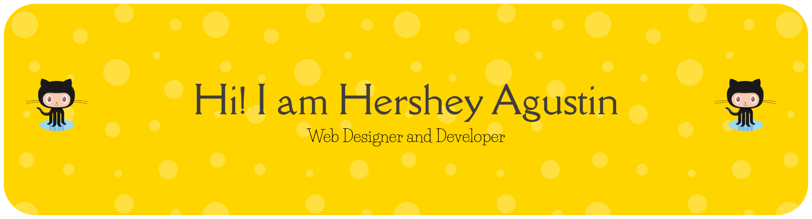

<h3 align="center">Web designer & developer based in Edmonton, Alberta 🌐 I build simple, readable, and accessible websites that connect with users and support business goals.</h3>

- 👨‍💻 Check out what I’ve built at:  [https://hershagustin.com/](https://hershagustin.com/)

⚡When I’m not coding, you might catch me:  
- 🏃‍♂️ Running (if I can find the time)
- 🎻 Jamming on my violin  
- 🛍️ Designing digital goodies for my Etsy shop  
- 💻 Geeking out at tech workshops to stay sharp

I enjoy connecting with others, exploring creative opportunities, and staying up-to-date with the latest web technologies.

# Connect with Me:
 

# 💻 Tech Stack:
 

              

      

# 📊 GitHub Stats:
 
 

---

<!-- Proudly created with GPRM ( https://gprm.itsvg.in ) -->
