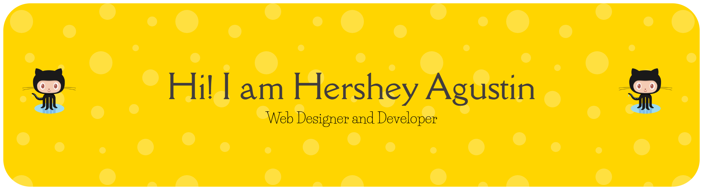

<h3 align="center">
Web Designer & Developer based in Edmonton, Alberta 🌐 
I build simple, readable, and accessible websites that connect with users and support business goals.
</h3>

  

👨‍💻 Check out what I’ve built / live websites at: (https://hershagustin.com/)

- 💼 Currently working as a Web Designer & SEO Specialist
  
- 🌱 Passionate about continuous learning through hackathons, tech workshops, and volunteer work as a Web Content Coordinator with AiLA, a non-profit and volunteer-led organization
 
- 💌 Got a project idea? Let’s build something together. Open to freelance work and collaborations.— shoot me an email! **hershagustin@gmail.com**
  

## ⚡ When I’m not coding, you might catch me:

- 🏃‍♂️ Running (if I can find the time)
- 🎻 Jamming on my violin
- 🛍️ Designing digital goodies for my Etsy shop
- 💻 Geeking out at tech workshops to stay sharp

I enjoy connecting with others, exploring creative opportunities, and staying up-to-date with the latest web technologies.

# 🤝 Connect with Me

  

# 💻 Tech Stack

  
  
  
  
  
  
  
  
  
  
  
  
  
  
  
  

# 📊 GitHub Stats

  

  

  
  

  

